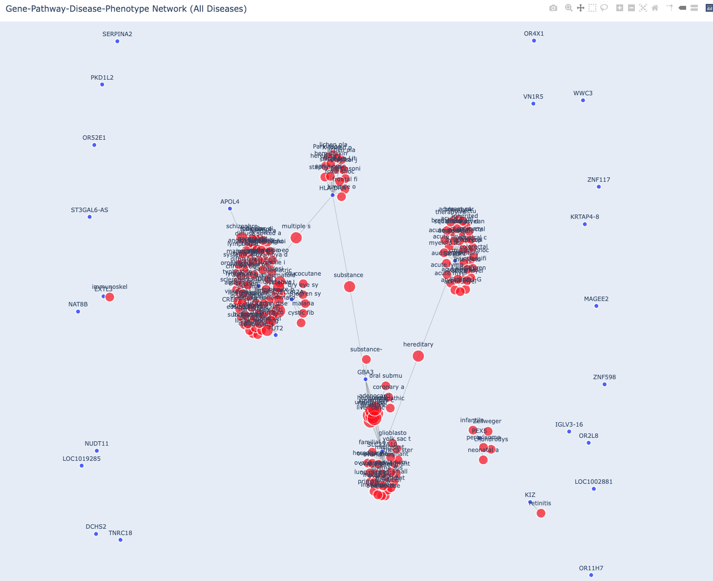

## Connecting genotype to phenotype with phasing information    

### Background  
Genomic phasing, the process of determining which genetic variants reside on the same chromosome (haplotype), is critical for unraveling complex genetic scenarios, such as compound heterozygosity or the effects of cis-regulatory variants. The foundation of this process lies in generating highly accurate and comprehensive phased data. At Complete Genomics, we have developed a robust pipeline [cWGS](https://github.com/Complete-Genomics/DNBSEQ_Complete_WGS/tree/dev), which produces high-fidelity phased VCF files with DeepVariant and HapCUT2.  
However, interpreting the results – detailed gene functions and variant impacts within the phased VCF – often requires significant manual interpretation by skilled variant curators to extract biological and clinical meaning. This process is time-consuming, limits throughput, and can vary between curators.  
To automate this interpretation, building on the foundation of high-quality phased data, we have designed an agentic workflow, enhanced with a RAG-Enhanced LLM Agent.  

### Keywords
Agentic, LLM, RAG/Langchain, FAISS, Haplotype Phasing, Gene/Variant Curation, Knowledge Graph, Literature Retrieval/Augmented      

### Results
1. Explore phased VCF, get variants with VEP HIGH impact on both copies, get gene networks connected by diseases, phenotypes and pathways by querying knowledge graph.  

```
vcf_file=data/HG002_exon.vep.vcf.gz
kg_path=db/kg.csv
ref_fai=db/GCA_000001405.15_GRCh38_no_alt_analysis_set.ercc.fa.fai
output_path=phased_results
python explore_phased_vcf.py --vcf_file $vcf_file --kg_path $kg_path --ref_fai $ref_fai
```
Output variants with VEP HIGH impact on both copies. Such vairants are used to mine Knowledge Graph to get gene networks connected by diseases, phenotypes and pathways. There are 2 files in the ./results folder: network_graph.html and gene_associations.json. The [results/network_graph.html](results/network_graph.html) is a interactive visulization.  

2. LLM RAG gene/variant curation agent querying PubMed literature.    
Set genes of interest (selected from the gene network) in gene_list.txt.  
Set PubMed API email in setting.json. 
Set DeepSeek API key in api_key.   
```
# Output PubMed abstracts to gene-specific files
python generate_pubmed_response.py 
# Query gene name with LLM alone 
python llm_queryAlone.py 
# Supply literature augmentation to LLM  
python llm_augmented.py  
# Use FAISS-powered RAG for grounded analysis
python llm_rag.py  
```
Example output: [./results/p2rx5_rag_analysis.json](results/p2rx5_rag_analysis.json).  

### Agentic Architecture

The system implements a multi-agent architecture with specialized components working in concert:

**1. Data Sources & Integration**
- **Knowledge Graph Integration**: Leverages PrimeKG to understand gene-disease-pathway relationships
- **Vector Store**: A FAISS index built from gene-specific PubMed abstracts.
- **Semantic Search**: Retrieves the most relevant text chunks for the LLM.
- **Analysis Method**: True Retrieval-Augmented Generation to prevent hallucinations.

**2. Workflow Pipeline**
```
Phased VCF → Variant Curator → Knowledge Graph Query → Literature Retrieval → Vector Store Creation → RAG Analysis → Clinical Report
```

**3. RAG-Enhanced Intelligence**
- **Retrieval-Augmented Generation**: Implements a true RAG pipeline using FAISS to find the most relevant literature snippets, preventing hallucinations.
- **Semantic Search**: Moves beyond simple context injection to perform semantic similarity searches on vectorized literature.
- **Evidence-Based Reasoning**: Ensures LLM claims are strictly supported by the retrieved, most relevant scientific evidence.

**4. Adaptive Workflow**
- **Gene List Processing**: Automatically reads and processes multiple genes from configuration
- **Error Recovery**: Continues analysis even when individual components fail
- **Scalable Architecture**: Handles single genes or batch processing seamlessly

**Agentic Components:**
- **Variant Curator Agent**: Identifies high-impact variants from phased data.
- **Knowledge Graph Agent**: Maps genes to disease networks and pathways.
- **Literature Retrieval Agent**: Fetches relevant PubMed abstracts automatically.
- **Vector Store Agent**: Creates and manages FAISS vector stores from literature.
- **Analysis Agent**: Performs RAG-enhanced genetic interpretation using the FAISS vector store.
- **Reporting Agent**: Generates structured clinical reports.

#### 🎯 Agentic Advantages

- **Scalability**: Processes hundreds of genes without human bottlenecks
- **Evidence-Grounded**: Reduces hallucinations through a FAISS-powered RAG pipeline.
- **Transparency**: Provides traceable reasoning from genotype to phenotype
- **Adaptability**: Updates analysis as new literature becomes available

This agentic approach transforms manual variant curation into an intelligent, automated system that maintains scientific rigor while dramatically improving throughput and consistency.

### Data Input
Data input as the output phased.vcf.gz from [cWGS](https://github.com/Complete-Genomics/DNBSEQ_Complete_WGS/tree/dev).  


### Methods and Materials  
1. Public Knowledge graph database  
With [PrimeKG](https://zitniklab.hms.harvard.edu/projects/PrimeKG/), download kg.csv to ./db.     
2. Phasing VCF  
With [Hapcut2](https://github.com/vibansal/HapCUT2). 
3. Variant annotation  
With [VEP](https://www.ensembl.org/vep). 
4. Environment  
Set environment.yml.  

### On Going  
1. Improve Pubmed, ClinVar based variant curation with LLM RAG  
2. Implement regulatory elements (promoter, enhancer etc.)  

### Reference  
1. [VEP](https://www.ensembl.org/vep)  
2. [CWGS](https://github.com/CGI-stLFR/CompleteWGS)  
co-barcoded NGS reads [stLFR](https://www.ncbi.nlm.nih.gov/pmc/articles/PMC6499310/)    
reads mapped with [Lariat](https://github.com/10XGenomics/lariat), a Linked-Read Alignment Tool   
1. [Deepvariant](https://github.com/google/deepvariant), deep learning-based variant caller  
2. [Hapcut2](https://github.com/vibansal/HapCUT2)  
3. [PubMed](https://pubmed.ncbi.nlm.nih.gov/)   
4. [ClinVar variant summary](https://ftp.ncbi.nlm.nih.gov/pub/clinvar/tab_delimited/)  
5. [PrimeKG](https://zitniklab.hms.harvard.edu/projects/PrimeKG/)  
6. [livtover](http://hgdownload.cse.ucsc.edu/goldenPath/hg38/liftOver/), hg38ToHg19.over.chain.gz  
7. [FAISS](https://github.com/facebookresearch/faiss)  
8. [Langchain](https://github.com/hwchase17/langchain)  
9. [DeepSeek](https://deepseek.com/)  
10. [HuggingFace](https://huggingface.co/)  

