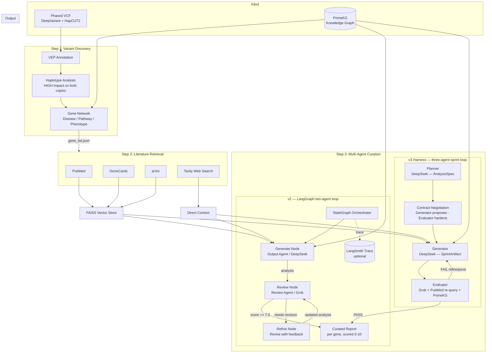

## PhasedVariants AgenticCurator

Automated gene/variant curation from phased whole-genome sequencing data, powered by a multi-agent LLM system with RAG.

### Background

Genomic phasing determines which genetic variants co-occur on the same chromosome (haplotype). This is critical for resolving compound heterozygosity and cis-regulatory effects. At Complete Genomics, the [cWGS pipeline](https://github.com/Complete-Genomics/DNBSEQ_Complete_WGS/tree/dev) produces high-fidelity phased VCF files using DeepVariant and HapCUT2.

Interpreting phased variants -- linking genotypes to gene function, disease mechanisms, and clinical significance -- traditionally requires manual curation by domain experts. This is slow, hard to scale, and inconsistent across curators.

This project automates that interpretation using a multi-agent LLM workflow with retrieval-augmented generation (RAG), knowledge graph integration, and iterative quality control.

**Keywords:** Multi-Agent Systems, RAG, FAISS, LLM, Haplotype Phasing, Gene/Variant Curation, Knowledge Graph, PubMed, GeneCards, arXiv, Tavily, Hallucination Reduction, LangChain, LangGraph, LangSmith, External-Evidence Evaluation, ClinGen, gnomAD, AlphaMissense, LLM Concordance Testing, Deterministic Scoring, Loss-of-Function QC

---

### Architecture

```mermaid
flowchart TD
    subgraph Input
        VCF[Phased VCF<br/>DeepVariant + HapCUT2]
        KG[(PrimeKG<br/>Knowledge Graph)]
    end

    subgraph Step1[Step 1: Variant Discovery]
        VEP[VEP Annotation]
        HAP[Haplotype Analysis<br/>HIGH impact on both copies]
        NET[Gene Network<br/>Disease / Pathway / Phenotype]
    end

    subgraph Step2[Step 2: Literature Retrieval]
        PM[PubMed]
        GC[GeneCards]
        AX[arXiv]
        TV[Tavily Web Search]
    end

    subgraph Step3[Step 3: Multi-Agent Curation]
        direction TB

        subgraph v2[v2 — LangGraph two-agent loop]
            SG[StateGraph Orchestrator]
            OA[Generate Node<br/>Output Agent / DeepSeek]
            RA[Review Node<br/>Review Agent / Grok]
            RF[Refine Node<br/>Revise with feedback]
            LS[(LangSmith Trace<br/>optional)]
            SG --> OA
            OA -->|analysis| RA
            RA -->|score >= 7.0| RPT
            RA -->|needs revision| RF
            RF -->|updated analysis| RA
            SG -. trace .-> LS
        end

        subgraph v3[v3 Harness — three-agent sprint loop]
            PL[Planner<br/>DeepSeek — AnalysisSpec]
            CN[Contract Negotiation<br/>Generator proposes · Evaluator hardens]
            GN[Generator<br/>DeepSeek — SprintArtifact]
            EV[Evaluator<br/>Grok + PubMed re-query + PrimeKG]
            PL --> CN --> GN --> EV
            EV -->|PASS| RPT
            EV -->|FAIL refine/pivot| GN
        end
    end

    subgraph Output
        RPT[Curated Report<br/>per gene, scored 0-10]
    end

    VCF --> VEP --> HAP --> NET
    KG --> NET
    NET -->|gene_list.json| Step2
    PM & GC & AX --> FAISS[FAISS Vector Store]
    TV --> DirectCtx[Direct Context]
    FAISS & DirectCtx --> OA
    FAISS & DirectCtx --> GN
    KG --> OA
    KG --> GN
```

The system operates in three steps:

1. **Variant Discovery** -- Parse phased VCF, identify variants with VEP HIGH impact on both haplotypes, and build gene networks via PrimeKG.
2. **Literature Retrieval** -- Multi-source progressive search (gene+disease+variant -> gene+disease -> gene only) across PubMed, GeneCards, arXiv, and Tavily.
3. **Multi-Agent Curation** -- Two workflow options (see below). Both use DeepSeek for generation and Grok for review to eliminate shared blind spots.

---

### Materials and Methods

#### Architecture Rationale: Hybrid Rule-Based + Agentic

This project deliberately avoids a fully end-to-end agent-driven workflow. In high-reliability domains such as bioinformatics and pharmaceutical analysis, pure agentic pipelines are still fragile: LLM outputs can vary across runs, and a small hallucination or poor decision early in a long chain can be amplified into a broken workflow.

The chosen design is a hybrid architecture. Deterministic, repeatable steps remain rule-based and auditable; agents are inserted only where ambiguity, literature reasoning, or expert-style judgment is useful.

| Scenario | Recommended approach | Why |
|----------|----------------------|-----|
| Structured, repeated, predictable steps | Rule-based scripts or workflow engines such as Nextflow, Snakemake, CWL, or Airflow | Deterministic, auditable, version-controlled, parallelizable, and low cost |
| Unstructured interpretation | Agent-assisted judgment, classification, anomaly detection, and hypothesis generation | LLMs are useful for fuzzy matching, literature synthesis, and detecting unusual patterns |
| Overall orchestration | Rule-based workflow controls the pipeline; agents run inside selected nodes | Combines stability with adaptive reasoning |

In this repository, variant parsing, VEP consequence extraction, knowledge-graph lookup, literature retrieval, and saved artifact evaluation are treated as deterministic pipeline steps. The agentic layer is limited to the gray areas: integrating heterogeneous literature evidence, deciding whether a gene report is sufficiently supported, flagging hallucination risk, revising weak analyses, and performing final sanity checks.

#### Multi-Agent Architecture (v2 — LangGraph two-agent loop)

The v2 workflow separates generation and evaluation into two independent agents:

- **Output Agent (DeepSeek)** -- Receives RAG context (FAISS: PubMed + GeneCards + arXiv), Tavily web context, and knowledge graph associations. Generates structured gene analysis. On subsequent iterations, receives Review Agent feedback and revises accordingly.
- **Review Agent (Grok/xAI)** -- Independently scores the analysis on 5 dimensions (completeness, accuracy, evidence support, clarity, clinical utility). Flags potential hallucinations by cross-referencing against literature context. Returns structured JSON feedback.
- **LangGraph Orchestrator** -- Defines Output Agent, Review Agent, and Refinement as `StateGraph` nodes. Conditional edges stop early when the quality threshold (7.0/10) is met or route back to refinement until max iterations are reached.

Using different LLMs for generation (DeepSeek) vs review (Grok) is intentional: it eliminates shared blind spots that occur when the same model evaluates its own output. Grok's strong web search grounding also improves fact-checking.

LangSmith is optional. The workflow runs without `LANGSMITH_API_KEY`; set it only when you want cloud tracing/debugging for the LangGraph generate/review/refine nodes. When enabled, traces are recorded under `LANGCHAIN_PROJECT` (default: `phasedvariants-agentic-curator`).

#### Harness Architecture (v3 — three-agent sprint loop)

The v3 harness addresses two persistent failure modes in v2: (1) the evaluator being too lenient when grading the same model's output, and (2) the generator losing coherence across long analyses without structured checkpoints.

Inspired by Anthropic's ["Harness design for long-running application development"](https://www.anthropic.com/engineering/harness-design-for-long-running-application-development) (Rajasekaran, 2026).

**Three agents, five sprints:**

| Agent | Model | Role |
|-------|-------|------|
| Planner | DeepSeek | Expands gene name → full `AnalysisSpec`: 5 sprints, literature targets, foreseeable hallucination pitfalls |
| Generator | DeepSeek | Executes one sprint at a time against a negotiated contract; refines or pivots based on evaluator feedback |
| Evaluator | Grok | Active verification: re-queries PubMed, cross-checks PrimeKG, scores 4 dimensions with hard floors |

**Sprint contract negotiation** — Before each sprint, Generator proposes deliverables and verification criteria; Evaluator tightens them. Only after both agree does generation start. This prevents post-hoc redefinition of "done".

**Active evaluation** — The Evaluator does not just read the output. It:
1. Re-queries PubMed for every cited claim (zero hits = flagged)
2. Cross-checks gene-disease associations against PrimeKG
3. Applies few-shot calibration examples to prevent score drift toward leniency
4. Enforces hard dimension floors: scientific accuracy ≥ 6.0, clinical utility ≥ 6.0, completeness ≥ 5.0
5. Treats any `HIGH` hallucination risk as an automatic FAIL

**Strategic decision after FAIL** — The Evaluator returns a `strategic_recommendation`: `refine` (keep direction, fix bugs) or `pivot` (start fresh with a different approach). The Generator acts on this recommendation in the next round.

All artifacts — spec, contracts, sprint outputs, eval results, harness state — are written to `results/harness_runs/<run_id>/` after every step, making runs auditable and resumable.

#### Comparison of Approaches

| Approach | Context | Agents | Quality Control | Hallucination Mitigation |
|----------|---------|--------|-----------------|--------------------------|
| `llm_queryAlone` | None | 1 | None | None |
| `llm_augmented` | PubMed text | 1 | None | Literature grounding |
| `llm_rag` | FAISS (PubMed+GeneCards+arXiv) + Tavily | 1 | None | RAG + web facts |
| `llm_agentic --legacy` | Same as RAG | 7 (planning/execution/reflection) | Self-reflection loop | RAG + reflection |
| `llm_agentic` (v2) | Same as RAG | 2 (DeepSeek + Grok) | Independent review agent (different LLM) | RAG + cross-model review + hallucination flagging |
| `harness` **(v3, recommended)** | Same as RAG | 3 (Planner + Generator + Evaluator) | Sprint contracts + active PubMed/KG verification + hard dimension floors | RAG + active claim re-querying + few-shot calibrated skeptical evaluator |

#### Data Sources

| Source | Purpose | Reference |
|--------|---------|-----------|
| [PrimeKG](https://zitniklab.hms.harvard.edu/projects/PrimeKG/) | Knowledge graph: gene-disease-pathway-phenotype associations | Download `kg.csv` to `./db` |
| [PubMed](https://pubmed.ncbi.nlm.nih.gov/) | Peer-reviewed biomedical abstracts | E-utilities API |
| [GeneCards](https://www.genecards.org/) | Gene function, aliases, pathways, disease associations | HTML scraping |
| [arXiv](https://arxiv.org/) | Computational biology preprints | Atom API |
| [Tavily](https://tavily.com/) | Real-time web search with AI-synthesized answers | REST API (requires key) |
| [ClinVar](https://ftp.ncbi.nlm.nih.gov/pub/clinvar/tab_delimited/) | Variant-level clinical significance | Tab-delimited download |

#### Tools and Algorithms

| Component | Tool | Why this choice |
|-----------|------|-----------------|
| Phasing | [HapCUT2](https://github.com/vibansal/HapCUT2) | State-of-the-art haplotype assembly from short reads |
| Variant calling | [DeepVariant](https://github.com/google/deepvariant) | Deep learning caller, highest accuracy in PrecisionFDA benchmarks |
| Variant annotation | [VEP](https://www.ensembl.org/vep) | Ensembl standard, supports consequence prediction and IMPACT classification |
| Vector store | [FAISS](https://github.com/facebookresearch/faiss) | Fast approximate nearest neighbor search; handles million-scale embeddings efficiently |
| Embeddings | [sentence-transformers/all-MiniLM-L6-v2](https://www.sbert.net/) | Good balance of speed and quality for biomedical text |
| LLM (Output Agent) | [DeepSeek](https://deepseek.com/) | Originally chosen for cost-effectiveness (2025); alternatives: [MiniMax](https://platform.minimaxi.com/), [Kimi](https://platform.moonshot.cn/) |
| LLM (Review Agent) | [Grok](https://x.ai/) | xAI model with strong search grounding; different LLM reduces shared blind spots in review |
| LLM framework | [LangChain](https://github.com/langchain-ai/langchain) | Text splitting, FAISS integration, retriever abstraction |
| Agent orchestration | [LangGraph](https://github.com/langchain-ai/langgraph) + optional [LangSmith](https://smith.langchain.com/) | Stateful Output -> Review -> Refine graph; LangSmith is optional and only used for trace observability |

---

### Results

#### Step 1: Variant Discovery and Gene Network

```bash
cd src
vcf_file=../data/HG002_exon.vep.vcf.gz
kg_path=../db/kg.csv
ref_fai=../db/GCA_000001405.15_GRCh38_no_alt_analysis_set.ercc.fa.fai
python explore_phased_vcf.py --vcf_file $vcf_file --kg_path $kg_path --ref_fai $ref_fai
```

- **Input:** Phased VCF with VEP annotations (FORMAT: `Uploaded_variation|Location|Allele|Gene|Feature|...`)
- **Output:** `results/network_graph.html` (interactive gene-disease-pathway network), `results/gene_associations.json`
- User selects genes of interest from the network, writes `gene_list.json` for downstream curation.


#### Step 2: Literature Retrieval

```bash
cd src
python literature_retrieval.py
```

- **Input:** `gene_list.json`
- **Output:** `results/{gene}_comprehensive_literature.json`, `results/{gene}_pubmed_response.txt`
- Sources: PubMed (biomedical abstracts), GeneCards (gene function/aliases/pathways), arXiv (computational biology preprints), Tavily (real-time web search with AI-synthesized answers).
- Progressive search strategy with query tracking (`query_used` field) for transparency.

#### Step 3a: Multi-Agent Curation (v2)

```bash
cd src
python llm_agentic.py            # v2 multi-agent (LangGraph two-agent loop)
python llm_agentic.py --legacy   # v1 planning+execution+reflection
```

- **Input:** `gene_list.json`, literature files from Step 2, knowledge graph
- **Output:** `results/{gene}_multiagent_analysis.json`, `results/{gene}_multiagent_report.md`

Alternative single-agent approaches for comparison:

```bash
python llm_queryAlone.py     # LLM alone (no context, baseline)
python llm_augmented.py      # LLM + PubMed text (simple augmentation)
python llm_rag.py            # LLM + FAISS RAG (single-agent)
```

#### Step 3b: Harness v3 — Three-Agent Sprint Loop (Recommended)

```bash
# Single gene
python -m harness.orchestrator P2RX5

# With optional VCF context string
python -m harness.orchestrator P2RX5 --vcf "compound het: c.123A>G + c.456C>T"

# Custom output directory
python -m harness.orchestrator P2RX5 --results-dir /path/to/results

# From Python
from harness import run_harness
result = run_harness("P2RX5")
```

- **Input:** gene symbol (VCF context optional); literature files and `gene_associations.json` from Steps 1–2
- **Output:**
  - `results/{gene}_harness_analysis.json` — full structured results with per-sprint scores
  - `results/{gene}_harness_report.md` — clinical report
  - `results/harness_runs/<run_id>/` — all intermediate artifacts (spec, contracts, sprint outputs, eval results)

Verify a harness run against deterministic acceptance criteria:

```bash
python eval_harness/run_harness.py --tasks eval_harness/tasks/p2rx5_harness_v2.json
```

Note what that command does and does not establish: it checks whether the agent's
own score cleared the agent's own threshold. It is a regression test, not a
correctness test. Correctness is evaluated separately, against sources outside
the system — see below.

#### Step 4: External-Evidence Evaluation

Generator and evaluator share a model family and a prompt lineage, so they share
blind spots, and no number produced inside that loop can certify it. The
`eval_harness/external/` layer routes each part of "is this correct?" to a source
that can actually answer it — PubMed for citations, ClinGen and ClinVar expert
panels for labels — and states plainly which parts remain unanswerable without a
human reviewer.

```bash
# Objective citation audit: PMID existence, retrieval grounding, metadata, retractions
python eval_harness/external/citation_audit.py --gene P2RX5

# Frozen, versioned external gold set (ClinGen gene-disease + ClinVar 3-star)
python eval_harness/external/build_gold_set.py --source all --n 200

# Regression tests for the audit logic itself (no network)
python eval_harness/external/test_external_eval.py
```

**First-run finding: citation resolvability is 0.000** across all 7 P2RX5
artifacts and all 6 approaches — 191 claims, 20 citation markers, none carrying a
resolvable identifier. The curator emits `[PubMed: Razzoli et al.]` and
`[GeneCards]`, which name a source but carry no id, while the retrieval layer
holds 10 real PMIDs that are dropped before reaching the output. So the
hallucinated-citation rate is currently **unmeasurable in either direction** —
not good, not bad, uncheckable. That is a prompt/schema defect and a prerequisite
for every other citation metric.

See [`eval_harness/external/README.md`](eval_harness/external/README.md) for the
full decomposition of what is verifiable without a human reviewer, why
claim–evidence entailment is deliberately left unimplemented, and the gold-set
sampling and contamination-control design.

#### Step 5: Concordance Testing, and Why the Curator's Architecture Changed

The 200-task ClinGen gold set makes it possible to ask the harder question: not
"are the citations checkable" but "does the curator's classification agree with
expert curation." Run across two models and a hidden-reasoning control (600 tasks
total, $1.6 combined):

| arm | DeepSeek | DeepSeek + reasoning | Gemini 3 Flash |
|---|---:|---:|---:|
| direct | 0.215 | 0.220 | 0.265 |
| rag | 0.080 | 0.125 | 0.195 |
| agentic | 0.095 | 0.117 | 0.250 |
| agentic_revision | 0.065 | n/a | 0.225 |

(`accuracy_all` against a 7-way label space; random baseline 0.143.) Two findings
survived scrutiny: **"revision helps" and "revision hurts" are both true, model-
dependently** (worst arm on DeepSeek, best on Gemini — a single-model run would
have produced a false general claim), and **both models share a real failure**:
they recognize a well-established (Definitive) gene-disease relationship but
cannot distinguish Moderate from Disputed from Refuted.

That failure has a mechanistic explanation. ClinGen classification is not a
judgement call, it is points: genetic evidence capped at 12, experimental at 6,
and **Strong and Definitive occupy the identical 12–18 point range** — separated
only by whether ≥2 publications replicated the finding across ≥3 years. That is
bookkeeping over dates, not something inferable from skimming a few abstracts.

So the architecture changed to match how text-to-SQL splits translation from
execution: the model reads one paper and emits structured evidence (which papers,
how many probands, what point category); a deterministic engine
([`src/clingen_scoring.py`](src/clingen_scoring.py), 24 tests) applies ClinGen's
own caps and replication rule and computes the tier. The model never outputs a
classification directly. [`eval_harness/external/clingen_evidence.py`](eval_harness/external/clingen_evidence.py)
scrapes ClinGen's assertion pages into field-level gold for scoring extraction
accuracy this way, and [`src/evidence_extraction.py`](src/evidence_extraction.py)
does the extraction — using controlled vocabularies read off ClinGen's real
records, computing cross-paper proband de-duplication deterministically from
model-reported identifying features rather than trusting an opaque match, and
rejecting its own output when it looks fabricated (caught on the first live run:
an abstract-only source had "nine individuals" expanded into nine records sharing
one invented variant string).

Measured ceiling on this approach: only **~20%** of ClinGen-scored publications are
open-access enough to fetch programmatically in full text (of 159 scored PMIDs,
61.6% have a PMCID, and only 32% of those permit XML download — most publishers
block it outright). That ceiling belongs to automated fetching, not to what a real
curator can read via institutional access, so `evidence_extraction.py --pdf <file>`
accepts a curator-supplied PDF directly, with guards against a scanned page (no
text layer) and a wrong-file upload (gene symbol absent from the extracted text).

#### Biallelic LoF Screen (`src/lof_qc.py`)

The compound-heterozygosity screen described in Background — genes with a
HIGH-impact variant on *both* haplotypes within one phase set — originally used
raw VEP `IMPACT=HIGH` with no downstream filtering, and its consequence-selection
logic picked one CSQ entry per variant somewhat arbitrarily, missing 79% of true
HIGH calls on a chr22 test (13 of 63 detected) and at least one outright
mis-attribution to a neighbouring gene. `lof_qc.py` fixes the selection (every
gene/transcript consequence is kept, not collapsed to one) and adds a real LoF
filter chain: non-coding-transcript, MANE-Select-only, NMD-escape (50nt rule),
gnomAD allele frequency, and gnomAD homozygote tolerance — deliberately *not*
pLI/LOEUF, which measure heterozygous-LoF intolerance and would preferentially
discard the true positives a *recessive* screen is looking for (real gnomAD v4.0
values: CFTR LOEUF = 1.153, the textbook recessive disease gene, sits squarely in
"tolerant" territory).

Whole-genome run on a real individual VCF (`data/human/`, 4.89M records): 143 raw
candidate genes → **3** after QC, all homozygous LoF, none from a phase-resolved
compound-heterozygous pair. A silently-failed gnomAD lookup earlier let two common
polymorphisms (TMEM216 AF 0.72/43k homozygotes, VDR AF 0.66/34k homozygotes)
through as false candidates — now a failed frequency lookup escalates rather than
passing silently, a distinction worth being deliberate about in a genomics
pipeline. Of the 11 genes where phase actually mattered (≥2 heterozygous LoF
calls), 6 were phase-resolved (4 trans, 2 cis) and 5 could not be determined —
**54.5% phase-resolution rate**, a more honest headline metric than a raw gene count.

Extending the screen to HIGH+MODERATE pairs (compound-het configurations like
CFTR's canonical null+missense, which the HIGH-only screen structurally misses)
raises candidate count 80× but most of the increase is unranked missense/missense
pairs. [AlphaMissense](https://www.nature.com/articles/s41586-023-06821-8)
pathogenicity scores narrow 306 MODERATE/MODERATE trans candidates to 1 when both
sides are required to score `likely_pathogenic` — the yield, not the discrimination
AUC, is the usable result here (only 2 ClinVar-labelled pathogenic variants exist
in this individual's callset, too few for a reliable AUC on this sample).
AlphaMissense is CC-BY-NC-SA 4.0 — evaluation and portfolio use only, not
production, without a licence review.

---

### Setup

1. Create conda environment:
   ```bash
   conda env create -f environment.yml
   conda activate dev
   ```

2. Set API keys in `.env` (see `.env.example`):
   ```
   DEEPSEEK_API_KEY=your-key       # Output Agent
   GROK_API_KEY=your-key            # Review Agent (https://console.x.ai/)
   TAVILY_API_KEY=your-key          # Web search
   PUBMED_EMAIL=your.email@example.com
   LANGSMITH_API_KEY=your-key       # Optional: LangGraph cloud tracing/debugging only
   LANGCHAIN_PROJECT=phasedvariants-agentic-curator  # Optional LangSmith project name
   ```

3. Download PrimeKG knowledge graph:
   ```bash
   # Download kg.csv from https://zitniklab.hms.harvard.edu/projects/PrimeKG/
   # Place in ./db/kg.csv
   ```

4. Prepare phased VCF input (output from [cWGS pipeline](https://github.com/Complete-Genomics/DNBSEQ_Complete_WGS/tree/dev)).

---

### Project Structure

```
.
├── harness/                        # Step 3b: three-agent harness (v3, recommended)
│   ├── __init__.py                 # run_harness() entry point
│   ├── artifacts.py                # Typed dataclasses: AnalysisSpec, SprintContract, SprintArtifact, EvalResult
│   ├── planner_agent.py            # Expands gene name → 5-sprint AnalysisSpec
│   ├── sprint_contract.py          # Generator-Evaluator contract negotiation
│   ├── generator_agent.py          # Sprint-aware generator with refine/pivot strategy
│   ├── evaluator_agent.py          # Skeptical evaluator: PubMed re-query + KG check + hard thresholds
│   └── orchestrator.py             # Three-agent coordinator + CLI
├── src/
│   ├── explore_phased_vcf.py       # Step 1: variant discovery
│   ├── vep.py                      # VEP annotation parsing
│   ├── primeKG.py                  # Knowledge graph queries
│   ├── visualize_gene_pathway_disease_phenotype.py
│   ├── literature_retrieval.py     # Step 2: multi-source literature search
│   ├── llm_agentic.py             # Step 3a: v2 entry point
│   ├── multi_agent_workflow.py     # v2 multi-agent (Output Agent + Review Agent)
│   ├── agentic_framework.py        # v1 legacy (planning+execution+reflection)
│   ├── planning_agent.py           # v1 planning agent
│   ├── reflection_agent.py         # v1 reflection agent
│   ├── llm_rag.py                  # Single-agent RAG approach
│   ├── llm_augmented.py            # Simple literature augmentation
│   ├── llm_queryAlone.py           # LLM-only baseline
│   ├── config.py                   # API key management
│   ├── lof_qc.py                   # Step 5: biallelic LoF screen + QC filter chain
│   ├── test_lof_qc.py              # 37 tests, incl. cis/trans phasing logic
│   ├── eval_alphamissense.py       # AlphaMissense coverage/discrimination/yield eval
│   ├── clingen_scoring.py          # Deterministic ClinGen point-scoring engine
│   ├── test_clingen_scoring.py     # 24 tests, incl. end-to-end NANS reproduction
│   ├── evidence_extraction.py      # LLM evidence extraction (+ --pdf ingestion path)
│   └── test_evidence_extraction.py # 17 tests, incl. synthetic-PDF fixtures
├── eval_harness/
│   ├── run_harness.py              # Deterministic artifact checker (no LLM calls)
│   ├── tasks/
│   │   ├── p2rx5_smoke.json        # v2 acceptance task
│   │   └── p2rx5_harness_v2.json   # v3 harness acceptance task
│   ├── external/                   # Step 4/5: external-evidence eval layer
│   │   ├── citation_audit.py       # Objective PMID/citation checker (no LLM)
│   │   ├── build_gold_set.py       # Frozen ClinGen/ClinVar gold-set builder
│   │   ├── clingen_evidence.py     # Field-level ClinGen evidence scraper (gold)
│   │   ├── run_concordance.py      # Curator-vs-ClinGen concordance runner
│   │   ├── pubmed_client.py        # Cached, rate-limited PubMed E-utilities client
│   │   └── test_external_eval.py   # 37 tests, no network
│   ├── gold/                       # Frozen gold-set snapshots + manifest (tracked)
│   └── cache/                      # API response cache (gitignored, regenerable)
├── data/                           # Phased VCF input
│   └── human/                      # Real-individual VCF for Step 5 evaluation
├── db/                             # PrimeKG kg.csv, reference genome index
│   └── annot/                      # ClinVar VCF, AlphaMissense scores (gitignored)
├── results/
│   ├── harness_runs/               # Per-run artifacts: spec, contracts, sprint outputs, eval logs
│   └── ...                         # JSON reports, FAISS indices
├── images/                         # Documentation images
├── gene_list.json                  # Genes of interest (user-created)
├── environment.yml                 # Conda environment
└── .env                            # API keys (not committed)
```

---

### Discussion and Ongoing Work

**Current limitations:**
- Citation resolvability in the v2/v3 curator output is 0.000 (Step 4) — the
  generator emits `[PubMed: Author et al.]` markers with no PMID, so hallucination
  rate is currently unmeasurable rather than known-good or known-bad. This is the
  single highest-priority fix; every downstream citation metric is blocked on it.
- Tier classification (Definitive/Strong/.../Refuted) is a weak target for direct
  LLM judgement — see Step 5 — and the curator's v2/v3 output still asks for it
  directly rather than routing through the deterministic scorer.
- The evidence-extraction pipeline (`evidence_extraction.py`) is validated on one
  synthetic fixture end-to-end; it has not yet been scored against the field-level
  `clingen_evidence.py` gold at scale, and cross-publication proband
  de-duplication has not been run across a real multi-paper gene.
- Full-text retrieval covers only ~20% of ClinGen-scored publications
  automatically; the `--pdf` path removes this ceiling for a curator with journal
  access but has not been tested against a real paywalled paper.
- Regulatory element analysis (promoters, enhancers) is not yet implemented.
- GeneCards scraping may break with website changes; a direct API integration would be more robust.

**Planned improvements:**
1. Make citations resolvable (require `[PMID: nnnnnnnn]`, thread PMIDs through RAG
   chunking) and re-run `citation_audit.py` for a real rate.
2. Score `evidence_extraction.py` against `clingen_evidence.py` gold at the field
   level (proband count, scored-publication recall, variant type) with error
   attribution, rather than at the tier level.
3. Run cross-publication proband de-duplication end to end on a real multi-paper
   gene and compare the resulting proband count to ClinGen's.
4. Regulatory element annotation (promoter, enhancer, UTR variants).
5. Harness resume: load `harness_state.json` to skip completed sprints on re-run.
6. Batch processing for large gene panels (100+ genes) with parallel sprint execution.

**Done, previously listed here as planned:** systematic v2/v3/agentic-revision
evaluation with concordance and hallucination measurement (Step 5) — the honest
result was that direct tier classification is the wrong target, not that the
curator scored well on it.

---

### References

1. [cWGS](https://github.com/Complete-Genomics/DNBSEQ_Complete_WGS/tree/dev) - Complete WGS pipeline (DeepVariant + HapCUT2)
2. [DeepVariant](https://github.com/google/deepvariant) - Deep learning variant caller
3. [HapCUT2](https://github.com/vibansal/HapCUT2) - Haplotype phasing
4. [VEP](https://www.ensembl.org/vep) - Variant Effect Predictor
5. [PrimeKG](https://zitniklab.hms.harvard.edu/projects/PrimeKG/) - Precision Medicine Knowledge Graph
6. [PubMed](https://pubmed.ncbi.nlm.nih.gov/) - Biomedical literature
7. [GeneCards](https://www.genecards.org/) - Gene database
8. [arXiv](https://arxiv.org/) - Preprints
9. [Tavily](https://tavily.com/) - Web search API
10. [ClinVar](https://ftp.ncbi.nlm.nih.gov/pub/clinvar/tab_delimited/) - Variant clinical significance
11. [FAISS](https://github.com/facebookresearch/faiss) - Vector similarity search
12. [LangChain](https://github.com/langchain-ai/langchain) - LLM application framework
13. [DeepSeek](https://deepseek.com/) - LLM for Output Agent (originally chosen 2025; alternatives: MiniMax/Kimi)
14. [Grok](https://x.ai/) - LLM for Review Agent (xAI, strong search grounding)
15. [Sentence Transformers](https://www.sbert.net/) - Text embeddings
16. [stLFR](https://www.ncbi.nlm.nih.gov/pmc/articles/PMC6499310/) - Co-barcoded NGS reads
17. [liftOver](http://hgdownload.cse.ucsc.edu/goldenPath/hg38/liftOver/) - Genome coordinate conversion
18. [Harness design for long-running application development](https://www.anthropic.com/engineering/harness-design-for-long-running-application-development) - Rajasekaran et al., Anthropic 2026 — design principles behind the v3 harness
19. [ClinGen Gene-Disease Validity SOP](https://clinicalgenome.org/docs/gene-disease-validity-standard-operating-procedure/) - the point-scoring framework `clingen_scoring.py` implements
20. [gnomAD](https://gnomad.broadinstitute.org/) - population allele frequency and constraint metrics used by `lof_qc.py`
21. [AlphaMissense](https://www.nature.com/articles/s41586-023-06821-8) - Cheng et al., Nature 2023 — missense pathogenicity scores (CC-BY-NC-SA 4.0, evaluation use only)
22. [MANE](https://www.ncbi.nlm.nih.gov/refseq/MANE/) - Matched Annotation from NCBI and EMBL-EBI, canonical transcript selection
23. [PyMuPDF](https://pymupdf.readthedocs.io/) - PDF text extraction for the curator-supplied-paper ingestion path
