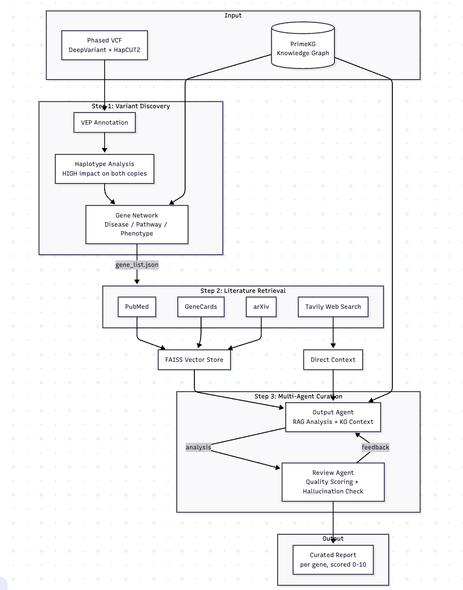
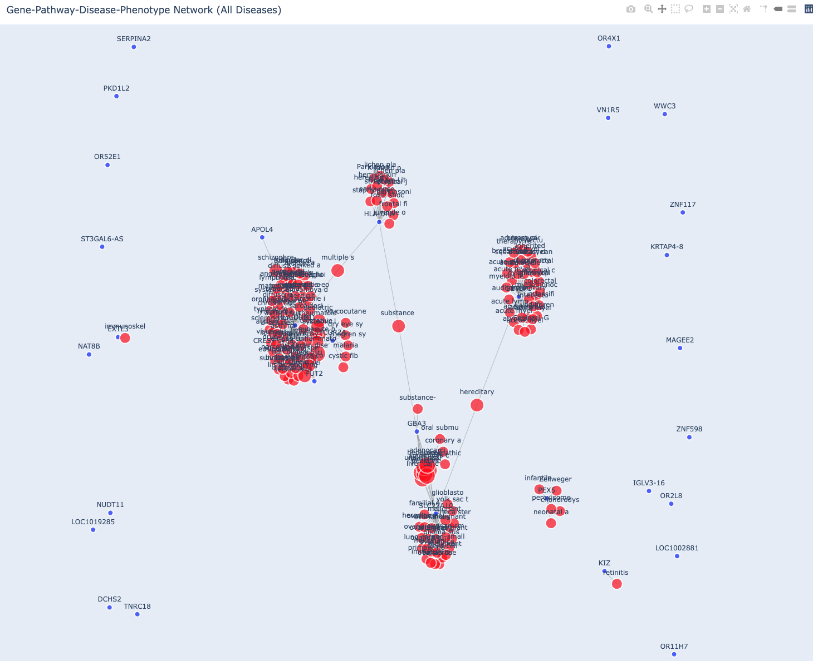

## PhasedVariants AgenticCurator

Automated gene/variant curation from phased whole-genome sequencing data, powered by a multi-agent LLM system with RAG.

### Background

Genomic phasing determines which genetic variants co-occur on the same chromosome (haplotype). This is critical for resolving compound heterozygosity and cis-regulatory effects. At Complete Genomics, the [cWGS pipeline](https://github.com/Complete-Genomics/DNBSEQ_Complete_WGS/tree/dev) produces high-fidelity phased VCF files using DeepVariant and HapCUT2.

Interpreting phased variants -- linking genotypes to gene function, disease mechanisms, and clinical significance -- traditionally requires manual curation by domain experts. This is slow, hard to scale, and inconsistent across curators.

This project automates that interpretation using a multi-agent LLM workflow with retrieval-augmented generation (RAG), knowledge graph integration, and iterative quality control.

**Keywords:** Multi-Agent Systems, RAG, FAISS, LLM, Haplotype Phasing, Gene/Variant Curation, Knowledge Graph, PubMed, GeneCards, arXiv, Tavily, Hallucination Reduction

---

### Architecture
  

The system operates in three steps:

1. **Variant Discovery** -- Parse phased VCF, identify variants with VEP HIGH impact on both haplotypes, and build gene networks via PrimeKG.
2. **Literature Retrieval** -- Multi-source progressive search (gene+disease+variant -> gene+disease -> gene only) across PubMed, GeneCards, arXiv, and Tavily.
3. **Multi-Agent Curation** -- An Output Agent generates literature-grounded analysis; a Review Agent independently evaluates quality (5 dimensions, 0-10 scale) and flags hallucinations. The loop iterates until the quality threshold is met.

---

### Results

#### Step 1: Variant Discovery and Gene Network

```bash
cd src
vcf_file=../data/HG002_exon.vep.vcf.gz
kg_path=../db/kg.csv
ref_fai=../db/GCA_000001405.15_GRCh38_no_alt_analysis_set.ercc.fa.fai
python explore_phased_vcf.py --vcf_file $vcf_file --kg_path $kg_path --ref_fai $ref_fai
```

- **Input:** Phased VCF with VEP annotations (FORMAT: `Uploaded_variation|Location|Allele|Gene|Feature|...`)
- **Output:** `results/network_graph.html` (interactive gene-disease-pathway network), `results/gene_associations.json`
- User selects genes of interest from the network, writes `gene_list.json` for downstream curation.



#### Step 2: Literature Retrieval

```bash
cd src
python literature_retrieval.py
```

- **Input:** `gene_list.json`
- **Output:** `results/{gene}_comprehensive_literature.json`, `results/{gene}_pubmed_response.txt`
- Sources: PubMed (biomedical abstracts), GeneCards (gene function/aliases/pathways), arXiv (computational biology preprints), Tavily (real-time web search with AI-synthesized answers).
- Progressive search strategy with query tracking (`query_used` field) for transparency.

#### Step 3: Multi-Agent Curation (Recommended)

```bash
cd src
python llm_agentic.py            # v2 multi-agent (default, recommended)
python llm_agentic.py --legacy   # v1 planning+execution+reflection
```

- **Input:** `gene_list.json`, literature files from Step 2, knowledge graph
- **Output:** `results/{gene}_multiagent_analysis.json`, `results/{gene}_multiagent_report.md`

Alternative single-agent approaches for comparison:

```bash
python llm_queryAlone.py     # LLM alone (no context, baseline)
python llm_augmented.py      # LLM + PubMed text (simple augmentation)
python llm_rag.py            # LLM + FAISS RAG (single-agent)
```

---

### Materials and Methods

#### Data Sources

| Source | Purpose | Reference |
|--------|---------|-----------|
| [PrimeKG](https://zitniklab.hms.harvard.edu/projects/PrimeKG/) | Knowledge graph: gene-disease-pathway-phenotype associations | Download `kg.csv` to `./db` |
| [PubMed](https://pubmed.ncbi.nlm.nih.gov/) | Peer-reviewed biomedical abstracts | E-utilities API |
| [GeneCards](https://www.genecards.org/) | Gene function, aliases, pathways, disease associations | HTML scraping |
| [arXiv](https://arxiv.org/) | Computational biology preprints | Atom API |
| [Tavily](https://tavily.com/) | Real-time web search with AI-synthesized answers | REST API (requires key) |
| [ClinVar](https://ftp.ncbi.nlm.nih.gov/pub/clinvar/tab_delimited/) | Variant-level clinical significance | Tab-delimited download |

#### Tools and Algorithms

| Component | Tool | Why this choice |
|-----------|------|-----------------|
| Phasing | [HapCUT2](https://github.com/vibansal/HapCUT2) | State-of-the-art haplotype assembly from short reads |
| Variant calling | [DeepVariant](https://github.com/google/deepvariant) | Deep learning caller, highest accuracy in PrecisionFDA benchmarks |
| Variant annotation | [VEP](https://www.ensembl.org/vep) | Ensembl standard, supports consequence prediction and IMPACT classification |
| Vector store | [FAISS](https://github.com/facebookresearch/faiss) | Fast approximate nearest neighbor search; handles million-scale embeddings efficiently |
| Embeddings | [sentence-transformers/all-MiniLM-L6-v2](https://www.sbert.net/) | Good balance of speed and quality for biomedical text |
| LLM (Output Agent) | [DeepSeek](https://deepseek.com/) | Originally chosen for cost-effectiveness (2025); alternatives: [MiniMax](https://platform.minimaxi.com/), [Kimi](https://platform.moonshot.cn/) |
| LLM (Review Agent) | [Grok](https://x.ai/) | xAI model with strong search grounding; different LLM reduces shared blind spots in review |
| LLM framework | [LangChain](https://github.com/langchain-ai/langchain) | Text splitting, FAISS integration, retriever abstraction |

#### Multi-Agent Architecture (v2)

The v2 workflow separates generation and evaluation into two independent agents:

- **Output Agent (DeepSeek)** -- Receives RAG context (FAISS: PubMed + GeneCards + arXiv), Tavily web context, and knowledge graph associations. Generates structured gene analysis. On subsequent iterations, receives Review Agent feedback and revises accordingly.
- **Review Agent (Grok/xAI)** -- Independently scores the analysis on 5 dimensions (completeness, accuracy, evidence support, clarity, clinical utility). Flags potential hallucinations by cross-referencing against literature context. Returns structured JSON feedback.
- **Orchestrator** -- Runs the Output Agent -> Review Agent loop up to N iterations. Stops early if quality threshold (7.0/10) is met.

Using different LLMs for generation (DeepSeek) vs review (Grok) is intentional: it eliminates shared blind spots that occur when the same model evaluates its own output. Grok's strong web search grounding also improves fact-checking. This design ensures the reviewer cannot be biased by the generation process (separate models, separate system prompts, separate concerns).

#### Comparison of Approaches

| Approach | Context | Agents | Quality Control | Hallucination Mitigation |
|----------|---------|--------|-----------------|--------------------------|
| `llm_queryAlone` | None | 1 | None | None |
| `llm_augmented` | PubMed text | 1 | None | Literature grounding |
| `llm_rag` | FAISS (PubMed+GeneCards+arXiv) + Tavily | 1 | None | RAG + web facts |
| `llm_agentic --legacy` | Same as RAG | 7 (planning/execution/reflection) | Self-reflection loop | RAG + reflection |
| `llm_agentic` (v2, default) | Same as RAG | 2 (DeepSeek + Grok) | Independent review agent (different LLM) | RAG + cross-model review + hallucination flagging |

---

### Setup

1. Create conda environment:
   ```bash
   conda env create -f environment.yml
   conda activate dev
   ```

2. Set API keys in `.env` (see `.env.example`):
   ```
   DEEPSEEK_API_KEY=your-key       # Output Agent
   GROK_API_KEY=your-key            # Review Agent (https://console.x.ai/)
   TAVILY_API_KEY=your-key          # Web search
   PUBMED_EMAIL=your.email@example.com
   ```

3. Download PrimeKG knowledge graph:
   ```bash
   # Download kg.csv from https://zitniklab.hms.harvard.edu/projects/PrimeKG/
   # Place in ./db/kg.csv
   ```

4. Prepare phased VCF input (output from [cWGS pipeline](https://github.com/Complete-Genomics/DNBSEQ_Complete_WGS/tree/dev)).

---

### Project Structure

```
.
├── src/
│   ├── explore_phased_vcf.py       # Step 1: variant discovery
│   ├── vep.py                      # VEP annotation parsing
│   ├── primeKG.py                  # Knowledge graph queries
│   ├── visualize_gene_pathway_disease_phenotype.py
│   ├── literature_retrieval.py     # Step 2: multi-source literature search
│   ├── llm_agentic.py             # Step 3: main entry point (v2 default)
│   ├── multi_agent_workflow.py     # v2 multi-agent (Output Agent + Review Agent)
│   ├── agentic_framework.py        # v1 legacy (planning+execution+reflection)
│   ├── planning_agent.py           # v1 planning agent
│   ├── reflection_agent.py         # v1 reflection agent
│   ├── llm_rag.py                  # Single-agent RAG approach
│   ├── llm_augmented.py            # Simple literature augmentation
│   ├── llm_queryAlone.py           # LLM-only baseline
│   └── config.py                   # API key management
├── data/                           # Phased VCF input
├── db/                             # PrimeKG kg.csv, reference genome index
├── results/                        # All outputs (JSON, reports, FAISS indices)
├── images/                         # Documentation images
├── gene_list.json                  # Genes of interest (user-created)
├── environment.yml                 # Conda environment
└── .env                            # API keys (not committed)
```

---

### Discussion and Ongoing Work

**Current limitations:**
- Variant curation (`_variant_curator_agent`) is a placeholder; full ClinVar integration is in progress to achieve variant -> disease/phenotype curation.
- Regulatory element analysis (promoters, enhancers) is not yet implemented.
- Quality scores depend on the LLM's self-assessment ability, which can be inconsistent.
- GeneCards scraping may break with website changes; a direct API integration would be more robust.

**Planned improvements:**
1. Full ClinVar-based variant curation with structured evidence levels (pathogenic/likely pathogenic/VUS).
2. Regulatory element annotation (promoter, enhancer, UTR variants).
3. Systematic evaluation: compare multi-agent output against manually curated gold-standard gene reports.
4. LangGraph integration for stateful agent orchestration with checkpointing.
5. Batch processing optimization for large gene panels (100+ genes).

---

### References

1. [cWGS](https://github.com/Complete-Genomics/DNBSEQ_Complete_WGS/tree/dev) - Complete WGS pipeline (DeepVariant + HapCUT2)
2. [DeepVariant](https://github.com/google/deepvariant) - Deep learning variant caller
3. [HapCUT2](https://github.com/vibansal/HapCUT2) - Haplotype phasing
4. [VEP](https://www.ensembl.org/vep) - Variant Effect Predictor
5. [PrimeKG](https://zitniklab.hms.harvard.edu/projects/PrimeKG/) - Precision Medicine Knowledge Graph
6. [PubMed](https://pubmed.ncbi.nlm.nih.gov/) - Biomedical literature
7. [GeneCards](https://www.genecards.org/) - Gene database
8. [arXiv](https://arxiv.org/) - Preprints
9. [Tavily](https://tavily.com/) - Web search API
10. [ClinVar](https://ftp.ncbi.nlm.nih.gov/pub/clinvar/tab_delimited/) - Variant clinical significance
11. [FAISS](https://github.com/facebookresearch/faiss) - Vector similarity search
12. [LangChain](https://github.com/langchain-ai/langchain) - LLM application framework
13. [DeepSeek](https://deepseek.com/) - LLM for Output Agent (originally chosen 2025; alternatives: MiniMax/Kimi)
14. [Grok](https://x.ai/) - LLM for Review Agent (xAI, strong search grounding)
15. [Sentence Transformers](https://www.sbert.net/) - Text embeddings
16. [stLFR](https://www.ncbi.nlm.nih.gov/pmc/articles/PMC6499310/) - Co-barcoded NGS reads
17. [liftOver](http://hgdownload.cse.ucsc.edu/goldenPath/hg38/liftOver/) - Genome coordinate conversion

