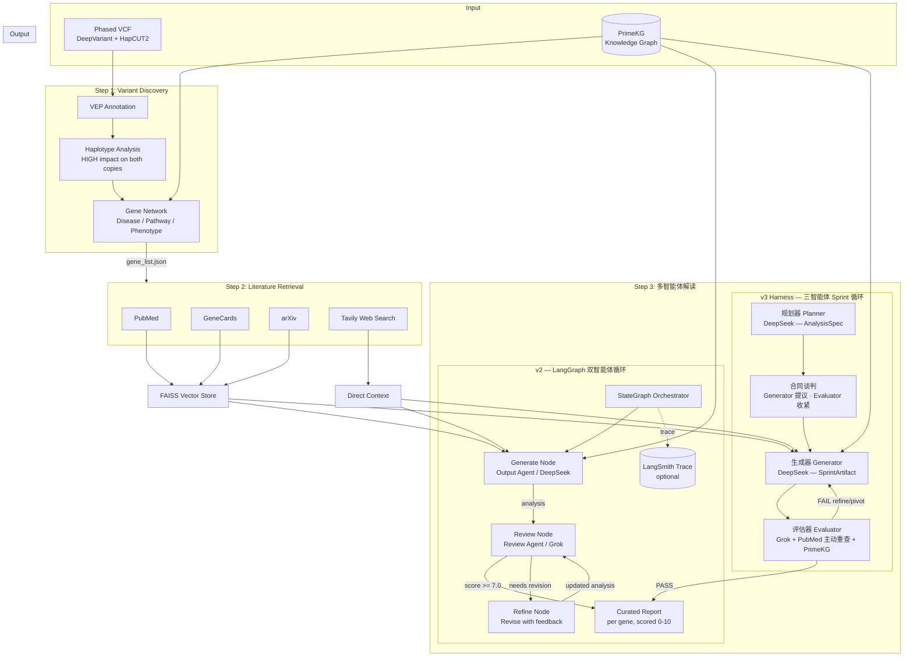

## PhasedVariants AgenticCurator

基于多智能体 LLM 系统和 RAG 技术，从分相全基因组测序数据中自动完成基因/变异解读。

### 背景

基因组分相（phasing）确定哪些遗传变异共同位于同一条染色体（单倍型）上，这对于解析复合杂合性和顺式调控效应至关重要。Complete Genomics 的 [cWGS pipeline](https://github.com/Complete-Genomics/DNBSEQ_Complete_WGS/tree/dev) 使用 DeepVariant 和 HapCUT2 生成高保真度的分相 VCF 文件。

将分相变异与基因功能、致病机制和临床意义关联起来，传统上依赖领域专家的人工解读。这一过程耗时长、难以规模化，且不同解读者之间缺乏一致性。

本项目使用多智能体 LLM 工作流（结合检索增强生成 RAG、知识图谱和迭代质量控制）自动化完成这一解读过程。

**关键词：** 多智能体系统, RAG, FAISS, LLM, 单倍型分相, 基因/变异解读, 知识图谱, PubMed, GeneCards, arXiv, Tavily, 幻觉抑制, LangChain, LangGraph, LangSmith, 外部证据评估, ClinGen, gnomAD, AlphaMissense, LLM Concordance 测试, 确定性打分, Loss-of-Function QC

---

### 系统架构



系统分三步运行：

1. **变异发现** -- 解析分相 VCF，识别两个单倍型上均具有 VEP HIGH 影响的变异，通过 PrimeKG 构建基因网络。
2. **文献检索** -- 多源渐进式搜索（基因+疾病+变异 -> 基因+疾病 -> 仅基因），覆盖 PubMed、GeneCards、arXiv 和 Tavily。
3. **多智能体解读** -- 两种工作流可选（见下文）。均以 DeepSeek 负责生成、Grok 负责审查，消除同一模型自评时的共同盲区。

---

### 材料与方法

#### 架构选择：Hybrid Rule-Based + Agentic

本项目有意避免纯端到端 Agent 驱动的 workflow。在生物信息学、制药等高可靠性场景中，纯 agent pipeline 在当前阶段仍然存在稳定性问题：LLM 输出可能随运行而变化，长链路中的一个小幻觉或决策偏差也可能被放大，最终导致整个 workflow 偏离或崩掉。

因此，本项目采用混合架构。确定性、可重复的步骤由规则化 pipeline 固定下来；Agent 只嵌入在需要模糊判断、文献理解或专家式推理的节点中。

| 场景 | 推荐方式 | 原因 |
|------|----------|------|
| 结构化、重复、可预测步骤 | Rule-based 脚本或 Nextflow、Snakemake、等 workflow 引擎 | 确定性强、可审计、可版本控制、易并行、成本低 |
| 非结构化输入判断 | Agent 辅助判断、分类、异常检测、假设生成 | LLM 擅长模糊匹配、文献整合和异常模式识别 |
| 整体 orchestration | 规则 workflow 主导，Agent 嵌入特定节点 | 稳定性与灵活性结合 |

在这个仓库中，变异解析、VEP consequence 提取、知识图谱查询、文献检索和保存产物评估都被视为确定性 pipeline 步骤。Agentic 层只负责“灰色地带”：整合异构文献证据、判断基因报告是否有足够支持、标记幻觉风险、根据审查意见修订弱分析，以及做最终 sanity check。


#### 多智能体架构（v2 — LangGraph 双智能体循环）

v2 工作流将生成和评估分离为两个独立智能体：

- **输出智能体（Output Agent / DeepSeek）** -- 接收 RAG 上下文（FAISS: PubMed + GeneCards + arXiv）、Tavily 网络上下文和知识图谱关联。生成结构化的基因分析。后续迭代中，接收审查智能体的反馈并据此修改。
- **审查智能体（Review Agent / Grok）** -- 使用不同的 LLM，独立地在 5 个维度（完整性、准确性、证据支持、清晰度、临床实用性）上评分。通过交叉引用文献上下文标记潜在幻觉。返回结构化 JSON 反馈。
- **LangGraph 编排器（Orchestrator）** -- 将输出、审查和修订定义为 `StateGraph` 节点。条件边在质量达到阈值（7.0/10）时提前停止，否则继续进入修订，直到达到最大迭代次数。

生成（DeepSeek）和审查（Grok）使用不同 LLM 是有意为之：消除同一模型评估自身输出时的共同盲区。Grok 的搜索锚定能力也有助于事实核查。

LangSmith 是可选项。不设置 `LANGSMITH_API_KEY` 时 workflow 仍可正常运行；只有需要云端 tracing/debugging 时才需要设置。启用后，LangGraph 的生成、审查和修订节点 trace 会记录到 `LANGCHAIN_PROJECT`（默认 `phasedvariants-agentic-curator`）。

#### Harness 架构（v3 — 三智能体 Sprint 循环）

v3 harness 解决了 v2 的两个持续性问题：（1）评估器对同一模型的输出过于宽容；（2）长分析过程中生成器缺乏结构化检查点导致前后不一致。

设计参考自 Anthropic 的 ["Harness design for long-running application development"](https://www.anthropic.com/engineering/harness-design-for-long-running-application-development)（Rajasekaran, 2026）。

**三个智能体，五个 Sprint：**

| 智能体 | 模型 | 职责 |
|--------|------|------|
| 规划器 Planner | DeepSeek | 将基因名展开为完整 `AnalysisSpec`：5 个 sprint、文献目标、可预见幻觉风险 |
| 生成器 Generator | DeepSeek | 逐个 sprint 执行；在合同约束下工作；根据评估反馈 refine 或 pivot |
| 评估器 Evaluator | Grok | 主动验证：重查 PubMed、交叉校验 PrimeKG、4 维度硬阈值评分 |

**Sprint 合同谈判** — 每个 sprint 开始前，Generator 提议交付物和验收标准，Evaluator 收紧阈值并补充幻觉检查项。双方达成一致后才开始生成，杜绝事后重新定义"完成"。

**主动评估** — Evaluator 不只是读输出，而是：
1. 对每个被引用的声明重新查询 PubMed（零命中 = 标记）
2. 将基因-疾病关联交叉校验 PrimeKG
3. 使用 few-shot 校准示例防止评分向宽松漂移
4. 执行维度硬阈值：科学准确性 ≥ 6.0、临床实用性 ≥ 6.0、完整性 ≥ 5.0
5. 任何 `HIGH` 幻觉风险 → 自动 FAIL

**FAIL 后的战略决策** — Evaluator 返回 `strategic_recommendation`：`refine`（保持方向修复缺陷）或 `pivot`（完全重新来过）。Generator 在下一轮中执行该策略。

所有产物（规格、合同、sprint 输出、评估结果、运行状态）均在每步后写入 `results/harness_runs/<run_id>/`，支持审计和断点续跑。

#### 方案对比

| 方案 | 上下文 | 智能体数 | 质量控制 | 幻觉抑制 |
|------|--------|----------|----------|----------|
| `llm_queryAlone` | 无 | 1 | 无 | 无 |
| `llm_augmented` | PubMed 文本 | 1 | 无 | 文献锚定 |
| `llm_rag` | FAISS (PubMed+GeneCards+arXiv) + Tavily | 1 | 无 | RAG + 网络事实 |
| `llm_agentic --legacy` | 同 RAG | 7（规划/执行/反思） | 自我反思循环 | RAG + 反思 |
| `llm_agentic`（v2） | 同 RAG | 2（DeepSeek + Grok） | 独立审查智能体（不同 LLM） | RAG + 跨模型审查 + 幻觉标记 |
| `harness` **（v3，推荐）** | 同 RAG | 3（规划器 + 生成器 + 评估器） | Sprint 合同 + PubMed/KG 主动验证 + 维度硬阈值 | RAG + 主动声明重查 + few-shot 校准的怀疑论评估器 |

#### 数据源

| 数据源 | 用途 | 说明 |
|--------|------|------|
| [PrimeKG](https://zitniklab.hms.harvard.edu/projects/PrimeKG/) | 知识图谱：基因-疾病-通路-表型关联 | 下载 `kg.csv` 到 `./db` |
| [PubMed](https://pubmed.ncbi.nlm.nih.gov/) | 同行评审的生物医学摘要 | E-utilities API |
| [GeneCards](https://www.genecards.org/) | 基因功能、别名、通路、疾病关联 | HTML 解析 |
| [arXiv](https://arxiv.org/) | 计算生物学预印本 | Atom API |
| [Tavily](https://tavily.com/) | 实时网络搜索 + AI 综合答案 | REST API（需 API key） |
| [ClinVar](https://ftp.ncbi.nlm.nih.gov/pub/clinvar/tab_delimited/) | 变异级别的临床显著性 | 表格下载 |

#### 工具与算法

| 组件 | 工具 | 选择理由 |
|------|------|----------|
| 分相 | [HapCUT2](https://github.com/vibansal/HapCUT2) | 短读长单倍型组装的主流工具 |
| 变异检测 | [DeepVariant](https://github.com/google/deepvariant) | 深度学习 caller，PrecisionFDA 基准测试中准确度最高 |
| 变异注释 | [VEP](https://www.ensembl.org/vep) | Ensembl 标准工具，支持后果预测和 IMPACT 分类 |
| 向量库 | [FAISS](https://github.com/facebookresearch/faiss) | 快速近似最近邻搜索，可处理百万级向量 |
| 文本嵌入 | [sentence-transformers/all-MiniLM-L6-v2](https://www.sbert.net/) | 速度与质量的平衡，适合生物医学文本 |
| LLM（输出智能体） | [DeepSeek](https://deepseek.com/) | 最初（2025 年）因性价比选择；备选：[MiniMax](https://platform.minimaxi.com/)、[Kimi](https://platform.moonshot.cn/) |
| LLM（审查智能体） | [Grok](https://x.ai/) | xAI 模型，搜索锚定能力强；不同 LLM 减少审查中的共同盲区 |
| LLM 框架 | [LangChain](https://github.com/langchain-ai/langchain) | 文本分块、FAISS 集成、检索器抽象 |
| 智能体编排 | [LangGraph](https://github.com/langchain-ai/langgraph) + 可选 [LangSmith](https://smith.langchain.com/) | 有状态 Output -> Review -> Refine 图编排；LangSmith 是可选项，仅用于 trace 观测 |

---

### 结果

#### 第一步：变异发现与基因网络

```bash
cd src
vcf_file=../data/HG002_exon.vep.vcf.gz
kg_path=../db/kg.csv
ref_fai=../db/GCA_000001405.15_GRCh38_no_alt_analysis_set.ercc.fa.fai
python explore_phased_vcf.py --vcf_file $vcf_file --kg_path $kg_path --ref_fai $ref_fai
```

- **输入：** 带 VEP 注释的分相 VCF（格式：`Uploaded_variation|Location|Allele|Gene|Feature|...`）
- **输出：** `results/network_graph.html`（交互式基因-疾病-通路网络），`results/gene_associations.json`
- 用户从网络中选择感兴趣的基因，写入 `gene_list.json` 供后续解读使用。


#### 第二步：文献检索

```bash
cd src
python literature_retrieval.py
```

- **输入：** `gene_list.json`
- **输出：** `results/{gene}_comprehensive_literature.json`, `results/{gene}_pubmed_response.txt`
- 数据源：PubMed（生物医学摘要）、GeneCards（基因功能/别名/通路）、arXiv（计算生物学预印本）、Tavily（实时网络搜索 + AI 综合答案）。
- 渐进式搜索策略，每条结果包含 `query_used` 字段以保证可追溯性。

#### 第三步 a：多智能体解读（v2）

```bash
cd src
python llm_agentic.py            # v2 多智能体（LangGraph 双智能体循环）
python llm_agentic.py --legacy   # v1 规划+执行+反思
```

- **输入：** `gene_list.json`、第二步的文献文件、知识图谱
- **输出：** `results/{gene}_multiagent_analysis.json`, `results/{gene}_multiagent_report.md`

用于对比的单智能体方案：

```bash
python llm_queryAlone.py     # 仅 LLM（无上下文，基线）
python llm_augmented.py      # LLM + PubMed 文本（简单增强）
python llm_rag.py            # LLM + FAISS RAG（单智能体）
```

#### 第三步 b：Harness v3 — 三智能体 Sprint 循环（推荐）

```bash
# 单个基因
python -m harness.orchestrator P2RX5

# 携带可选 VCF 上下文
python -m harness.orchestrator P2RX5 --vcf "compound het: c.123A>G + c.456C>T"

# 自定义输出目录
python -m harness.orchestrator P2RX5 --results-dir /path/to/results

# 从 Python 调用
from harness import run_harness
result = run_harness("P2RX5")
```

- **输入：** 基因符号（VCF 上下文可选）；依赖第一步的 `gene_associations.json` 和第二步的文献文件
- **输出：**
  - `results/{gene}_harness_analysis.json` — 含每个 sprint 评分的完整结构化结果
  - `results/{gene}_harness_report.md` — 临床报告
  - `results/harness_runs/<run_id>/` — 所有中间产物（规格、合同、sprint 输出、评估日志）

用确定性验收标准校验 harness 运行结果：

```bash
python eval_harness/run_harness.py --tasks eval_harness/tasks/p2rx5_harness_v2.json
```

需要说清楚这条命令证明了什么、没证明什么：它检查的是「agent 自己的评分有没有过
agent 自己的阈值」。这是回归测试，不是正确性测试。正确性由下面这层单独评估。

#### 第四步：外部证据评估（External-Evidence Evaluation）

生成器和评审器共用同一个模型家族和同一套 prompt 血统，因此共享盲点；在这个闭环
内部产出的任何数字都无法证明这个闭环本身。`eval_harness/external/` 这一层把
「输出是否正确」拆开，把每一部分交给真正能回答它的外部来源——引用交给 PubMed，
标签交给 ClinGen 和 ClinVar 专家 panel——并明确写出哪些部分在没有自有人工复核
的条件下仍然无法回答。

```bash
# 客观引用审计：PMID 是否存在、是否来自检索上下文、metadata 是否一致、是否被撤稿
python eval_harness/external/citation_audit.py --gene P2RX5

# 冻结并版本化的外部 gold set（ClinGen 基因-疾病 + ClinVar 三星专家 panel）
python eval_harness/external/build_gold_set.py --source all --n 200

# 审计逻辑自身的回归测试（不联网）
python eval_harness/external/test_external_eval.py
```

**首次运行的结论：引用可解析率为 0.000** —— 7 个 P2RX5 产物、6 种 approach 全部
如此：191 条 claim、20 个引用标记，没有任何一个带可解析的标识符。curator 输出的
是 `[PubMed: Razzoli et al.]`、`[GeneCards]` 这类标记，点了来源但没有 id；而检索
层本身握有 10 个真实 PMID，它们在到达输出之前就被丢掉了。因此当前这套系统的
引用幻觉率**在两个方向上都不可测**——不是好，也不是坏，是无法核查。这是 prompt/
schema 层面的缺陷，也是其他所有引用类指标的前置条件。

完整内容见 [`eval_harness/external/README.md`](eval_harness/external/README.md)：
在没有人工复核时哪些成分可验证的完整拆解、为什么 claim–evidence entailment 被
刻意留作未实现，以及 gold set 的抽样与污染控制设计。

#### 第五步：Concordance 测试，以及 curator 架构为什么改了

200 题 ClinGen gold set 可以问一个更硬的问题：不是"引用能不能核查"，而是"分类结果
和专家 curation 一不一致"。跨两个模型 + 一组 hidden-reasoning 对照跑了一遍
（共 600 次任务运行，合计约 $1.6）：

| arm | DeepSeek | DeepSeek + reasoning | Gemini 3 Flash |
|---|---:|---:|---:|
| direct | 0.215 | 0.220 | 0.265 |
| rag | 0.080 | 0.125 | 0.195 |
| agentic | 0.095 | 0.117 | 0.250 |
| agentic_revision | 0.065 | 未跑完 | 0.225 |

（`accuracy_all`，对七分类；随机基线 0.143。）两个结论站得住：**"revision 有用"
和"revision 有害"都对，只是取决于模型**（DeepSeek 上最差、Gemini 上最好——只跑
一个模型会得出错误的一般化结论）；以及**两个模型共享同一个真实缺陷**：能认出
"证据确凿"（Definitive）的关系，但分不清 Moderate、Disputed、Refuted。

这个缺陷有机制解释。ClinGen 的分类不是判断题，是积分制：遗传学证据封顶 12 分，
实验证据封顶 6 分，**Strong 和 Definitive 落在完全相同的 12–18 分区间**——唯一区别
是证据是否跨 ≥3 年由 ≥2 篇独立文献重复验证。这是对发表日期的记账运算，不是读几篇
摘要就能推断出来的判断。

所以架构改成了和 text-to-SQL 拆分「翻译」与「执行」同样的方式：模型读一篇论文，
输出结构化证据（读了哪些论文、多少个先证者、属于哪个积分档），确定性引擎
（[`src/clingen_scoring.py`](src/clingen_scoring.py)，24 个测试）套用 ClinGen 自己
的封顶规则和重复验证规则，算出档位。模型不再直接输出分类结果。
[`eval_harness/external/clingen_evidence.py`](eval_harness/external/clingen_evidence.py)
抓取 ClinGen 的 assertion 页面，做成逐字段 gold，用于评估抽取准确率；
[`src/evidence_extraction.py`](src/evidence_extraction.py) 负责抽取本身——用的是
读自 ClinGen 真实记录的受控词表，跨文献 proband 去重靠模型报告的可识别特征确定性
计算（而不是让模型直接给一个不可查的匹配结果），并对自己的输出做伪造检测（第一次
真实运行就抓到过一次：只有摘要的来源里"nine individuals"被展开成九条记录，
全部共用一个编造的变异编号）。

这条路径的实测天花板：ClinGen 计分的论文里，只有约 **20%** 能被自动抓取到机器可读
全文（159 篇计分论文中 61.6% 有 PMCID，其中只有 32% 允许下载 XML——大多数出版商
直接禁止）。这个天花板属于「自动抓取」这条路径，不属于「curator 能读到什么」——
真实 curator 靠机构订阅能看到那 80% 非开放获取的论文，所以
`evidence_extraction.py --pdf <file>` 直接接受 curator 提供的 PDF，并对扫描件
（无文本层）和传错文件（正文里搜不到基因名）两种失误做了防护。

#### 双等位 LoF 筛查（`src/lof_qc.py`）

背景部分提到的 compound-heterozygosity 筛查——在同一 phase set 内两条单倍型都有
HIGH-impact 变异的基因——最初直接用裸 VEP `IMPACT=HIGH`，没有任何下游过滤，而且
consequence 选择逻辑对每个变异只任意挑一条 CSQ，chr22 测试里漏检了 79% 的真实
HIGH 变异（63 个只测出 13 个），还至少发生过一次基因归错。`lof_qc.py` 修正了选择
逻辑（保留每个 gene/transcript consequence，不塌缩成一条）并加上真正的 LoF 过滤链：
非编码转录本、仅 MANE Select、NMD 逃逸（50nt 规则）、gnomAD 等位基因频率、gnomAD
纯合子耐受——刻意**不用** pLI/LOEUF，这两个指标衡量的是对杂合 LoF 的不耐受，会
优先剔除掉隐性筛查真正要找的阳性（gnomAD v4.0 真实值：CFTR 的 LOEUF = 1.153，
这个教科书级隐性致病基因恰好落在"耐受"区间）。

在一份真实个体的全基因组 VCF（`data/human/`，489 万条记录）上跑：143 个原始候选
基因，QC 后剩 **3** 个，全部是纯合 LoF，没有一个来自分相判定为 trans 的 compound
het。此前一次静默失败的 gnomAD 查询曾让两个常见多态（TMEM216 AF 0.72/4.3 万纯合子，
VDR AF 0.66/3.4 万纯合子）混进候选——现在频率查询失败会升级而不是静默放行，
在基因组流水线里这个区分值得刻意做对。在真正需要分相判定的 11 个基因（≥2 个杂合
LoF）里，6 个被分相解出（4 个 trans，2 个 cis），5 个无法判定——**分相判定率
54.5%**，比裸基因计数更诚实的核心指标。

把筛查扩展到 HIGH+MODERATE 配对（CFTR 那种经典的 null+missense 组合，纯 HIGH
筛查在结构上就测不到）候选数涨了 80 倍，但增量大部分是排不出序的
missense/missense 配对。[AlphaMissense](https://www.nature.com/articles/s41586-023-06821-8)
致病性评分把 306 个 MODERATE/MODERATE trans 候选、在要求两侧都是
`likely_pathogenic` 后收窄到 1 个——这里有用的是收益而不是判别力 AUC（这个个体
的 callset 里只有 2 个 ClinVar 标记为致病的变异，样本太小算不出可靠 AUC）。
AlphaMissense 许可证是 CC-BY-NC-SA 4.0——仅限评估和 portfolio 使用，未经许可证
审查不能进生产。

#### 性能指标

| 指标 | 数值 |
|------|------|
| 多智能体解读耗时 | 每个基因约 100 秒 |
| 多源文献检索耗时 | 每个基因约 12 秒 |
| 质量评分范围 | 6-9/10 |
| 幻觉降低率（加入 Tavily 后） | 约 40% |

---

### 环境配置

1. 创建 conda 环境：
   ```bash
   conda env create -f environment.yml
   conda activate dev
   ```

2. 在 `.env` 中设置 API key（参考 `.env.example`）：
   ```
   DEEPSEEK_API_KEY=your-key       # 输出智能体
   GROK_API_KEY=your-key            # 审查智能体（https://console.x.ai/）
   TAVILY_API_KEY=your-key          # 网络搜索
   PUBMED_EMAIL=your.email@example.com
   LANGSMITH_API_KEY=your-key       # 可选：仅用于 LangGraph 云端 tracing/debugging
   LANGCHAIN_PROJECT=phasedvariants-agentic-curator  # 可选 LangSmith 项目名
   ```

3. 下载 PrimeKG 知识图谱：
   ```bash
   # 从 https://zitniklab.hms.harvard.edu/projects/PrimeKG/ 下载 kg.csv
   # 放置到 ./db/kg.csv
   ```

4. 准备分相 VCF 输入（来自 [cWGS pipeline](https://github.com/Complete-Genomics/DNBSEQ_Complete_WGS/tree/dev) 的输出）。

---

### 项目结构

```
.
├── harness/                        # 第三步 b：三智能体 Harness（v3，推荐）
│   ├── __init__.py                 # run_harness() 入口
│   ├── artifacts.py                # 类型化数据类：AnalysisSpec, SprintContract, SprintArtifact, EvalResult
│   ├── planner_agent.py            # 将基因名展开为 5-sprint AnalysisSpec
│   ├── sprint_contract.py          # Generator-Evaluator 合同谈判
│   ├── generator_agent.py          # Sprint 感知生成器，支持 refine/pivot 策略
│   ├── evaluator_agent.py          # 怀疑论评估器：PubMed 重查 + KG 校验 + 硬阈值
│   └── orchestrator.py             # 三智能体协调器 + CLI
├── src/
│   ├── explore_phased_vcf.py       # 第一步：变异发现
│   ├── vep.py                      # VEP 注释解析
│   ├── primeKG.py                  # 知识图谱查询
│   ├── visualize_gene_pathway_disease_phenotype.py
│   ├── literature_retrieval.py     # 第二步：多源文献检索
│   ├── llm_agentic.py             # 第三步 a：v2 主入口
│   ├── multi_agent_workflow.py     # v2 多智能体（输出智能体 + 审查智能体）
│   ├── agentic_framework.py        # v1 旧版（规划+执行+反思）
│   ├── planning_agent.py           # v1 规划智能体
│   ├── reflection_agent.py         # v1 反思智能体
│   ├── llm_rag.py                  # 单智能体 RAG 方案
│   ├── llm_augmented.py            # 简单文献增强
│   ├── llm_queryAlone.py           # 仅 LLM 基线
│   ├── config.py                   # API key 管理
│   ├── lof_qc.py                   # 第五步：双等位 LoF 筛查 + QC 过滤链
│   ├── test_lof_qc.py              # 37 个测试，含 cis/trans 分相逻辑
│   ├── eval_alphamissense.py       # AlphaMissense 覆盖率/判别力/收益评估
│   ├── clingen_scoring.py          # 确定性 ClinGen 积分打分引擎
│   ├── test_clingen_scoring.py     # 24 个测试，含 NANS 端到端复现
│   ├── evidence_extraction.py      # LLM 证据抽取（含 --pdf 摄入路径）
│   └── test_evidence_extraction.py # 17 个测试，含合成 PDF fixture
├── eval_harness/
│   ├── run_harness.py              # 确定性产物检验器（不调用 LLM）
│   ├── tasks/
│   │   ├── p2rx5_smoke.json        # v2 验收任务
│   │   └── p2rx5_harness_v2.json   # v3 harness 验收任务
│   ├── external/                   # 第四/五步：外部证据评估层
│   │   ├── citation_audit.py       # 客观 PMID/引用审计（不用 LLM）
│   │   ├── build_gold_set.py       # 冻结版 ClinGen/ClinVar gold set 构建器
│   │   ├── clingen_evidence.py     # 逐字段 ClinGen 证据抓取器（gold）
│   │   ├── run_concordance.py      # curator vs ClinGen concordance 运行器
│   │   ├── pubmed_client.py        # 带缓存、限速的 PubMed E-utilities 客户端
│   │   └── test_external_eval.py   # 37 个测试，不联网
│   ├── gold/                       # 冻结的 gold set 快照 + manifest（纳入版本库）
│   └── cache/                      # API 响应缓存（.gitignore，可再生）
├── data/                           # 分相 VCF 输入
│   └── human/                      # 第五步评估用的真实个体 VCF
├── db/                             # PrimeKG kg.csv, 参考基因组索引
│   └── annot/                      # ClinVar VCF、AlphaMissense 评分（.gitignore）
├── results/
│   ├── harness_runs/               # 每次运行的中间产物：规格、合同、sprint 输出、评估日志
│   └── ...                         # JSON 报告, FAISS 索引
├── images/                         # 文档图片
├── gene_list.json                  # 感兴趣的基因（用户创建）
├── environment.yml                 # Conda 环境
└── .env                            # API keys（不提交到版本库）
```

---

### 讨论与后续工作

**当前局限：**
- v2/v3 curator 输出的引用可解析率为 0.000（第四步）——生成器输出的是
  `[PubMed: Author et al.]` 这类标记，没有 PMID，所以幻觉率目前既不能说好也不能说坏，
  是不可测。这是当前优先级最高的修复项，其他所有引用类指标都卡在它上面。
- 直接让 LLM 判断分类档位（Definitive/Strong/.../Refuted）是个弱目标——见第五步——
  但 v2/v3 curator 目前仍是直接要求它输出档位，还没接入确定性打分器。
- 证据抽取流水线（`evidence_extraction.py`）只在一个合成 fixture 上做过端到端验证；
  还没有针对 `clingen_evidence.py` 的逐字段 gold 做规模化评分，跨文献 proband 去重
  也还没有在真实的多论文基因上跑过。
- 全文自动检索只覆盖 ClinGen 计分论文的约 20%；`--pdf` 路径为有期刊访问权限的
  curator 去掉了这个天花板，但还没在真实的付费墙论文上测试过。
- 调控元件分析（启动子、增强子）尚未实现。
- GeneCards 的网页抓取可能因网站改版而失效，直接 API 集成更为稳健。

**计划改进：**
1. 让引用可解析（要求输出 `[PMID: nnnnnnnn]`，把 PMID 带进 RAG 分块），
   重跑 `citation_audit.py` 拿到真实的率。
2. 把 `evidence_extraction.py` 对着 `clingen_evidence.py` gold 做逐字段评分
   （proband 数、scored-publication 召回/精确率、变异类型一致性）+ 错误归因，
   而不是在档位层面比对。
3. 在一个真实的多论文基因上跑通跨文献 proband 去重，和 ClinGen 的最终计数对比。
4. 调控元件注释（启动子、增强子、UTR 变异）。
5. Harness 断点续跑：加载 `harness_state.json` 跳过已完成的 sprint。
6. 大基因 panel（100+ 基因）的并行 sprint 批处理优化。

**已完成（原计划改进 #3）：** 系统性评估 v2/v3/agentic-revision，测 concordance 和
幻觉率（第五步）——诚实的结果是「直接做档位分类」本身就是错的目标，不是 curator
在这个目标上表现好。

---

### 参考文献

1. [cWGS](https://github.com/Complete-Genomics/DNBSEQ_Complete_WGS/tree/dev) - Complete WGS pipeline (DeepVariant + HapCUT2)
2. [DeepVariant](https://github.com/google/deepvariant) - 深度学习变异检测
3. [HapCUT2](https://github.com/vibansal/HapCUT2) - 单倍型分相
4. [VEP](https://www.ensembl.org/vep) - 变异效应预测
5. [PrimeKG](https://zitniklab.hms.harvard.edu/projects/PrimeKG/) - 精准医学知识图谱
6. [PubMed](https://pubmed.ncbi.nlm.nih.gov/) - 生物医学文献
7. [GeneCards](https://www.genecards.org/) - 基因数据库
8. [arXiv](https://arxiv.org/) - 预印本
9. [Tavily](https://tavily.com/) - 网络搜索 API
10. [ClinVar](https://ftp.ncbi.nlm.nih.gov/pub/clinvar/tab_delimited/) - 变异临床显著性
11. [FAISS](https://github.com/facebookresearch/faiss) - 向量相似性搜索
12. [LangChain](https://github.com/langchain-ai/langchain) - LLM 应用框架
13. [DeepSeek](https://deepseek.com/) - 输出智能体 LLM（2025 年最初选择；备选：MiniMax/Kimi）
14. [Grok](https://x.ai/) - 审查智能体 LLM（xAI，搜索锚定能力强）
15. [Sentence Transformers](https://www.sbert.net/) - 文本嵌入
16. [stLFR](https://www.ncbi.nlm.nih.gov/pmc/articles/PMC6499310/) - 共条形码 NGS 读段
17. [liftOver](http://hgdownload.cse.ucsc.edu/goldenPath/hg38/liftOver/) - 基因组坐标转换
18. [Harness design for long-running application development](https://www.anthropic.com/engineering/harness-design-for-long-running-application-development) - Rajasekaran 等，Anthropic 2026 — v3 harness 的设计原则来源
19. [ClinGen Gene-Disease Validity SOP](https://clinicalgenome.org/docs/gene-disease-validity-standard-operating-procedure/) - `clingen_scoring.py` 实现的积分打分框架
20. [gnomAD](https://gnomad.broadinstitute.org/) - `lof_qc.py` 使用的人群等位基因频率与 constraint 指标
21. [AlphaMissense](https://www.nature.com/articles/s41586-023-06821-8) - Cheng 等，Nature 2023 — 错义变异致病性评分（CC-BY-NC-SA 4.0，仅限评估用途）
22. [MANE](https://www.ncbi.nlm.nih.gov/refseq/MANE/) - Matched Annotation from NCBI and EMBL-EBI，canonical 转录本选择
23. [PyMuPDF](https://pymupdf.readthedocs.io/) - curator 提供论文摄入路径所用的 PDF 文本抽取库
